# Live Chat Sequence Diagrams

**Status:** Draft  
**Version:** 0.1.0  
**Related documents:** `LIVE_CHAT_PRD.md`, `LIVE_CHAT_TRD.md`, `LIVE_CHAT_UI_DESIGN.md`, `LIVE_CHAT_UI_FLOW.md`

---

## 1. Actors and Responsibilities

| Actor | Responsibility |
|---|---|
| User | Membuka Live Chat, memilih produk, membaca/mengirim message, memberi rating |
| App Host | Aplikasi Flutter utama yang mengelola login dan auth session |
| Live Chat SDK/UI | Menampilkan UI, mengelola state, memanggil repository, dan mengatur lifecycle chat |
| REST API | Mengambil conversation, message, status, attachment, dan data artikel |
| WebSocket | Jalur realtime untuk message dan perubahan status |
| Live Chat Backend | Memproses request, menyimpan data, publish event, dan menghubungkan agent |
| Agent | Membalas message dan mengubah status conversation melalui sistem agent |
| Local Notification | Menampilkan notifikasi device saat app aktif dan event WebSocket diterima |

## 2. General Architecture

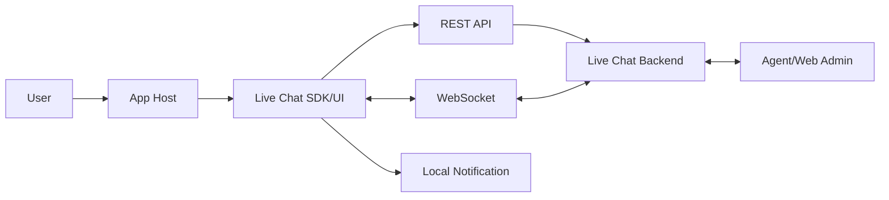

## 3. Open Live Chat After Login

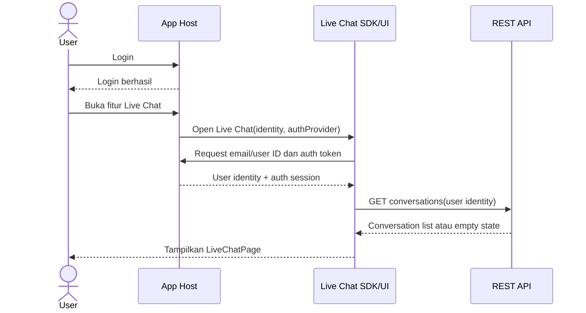

## 4. Load Conversation History

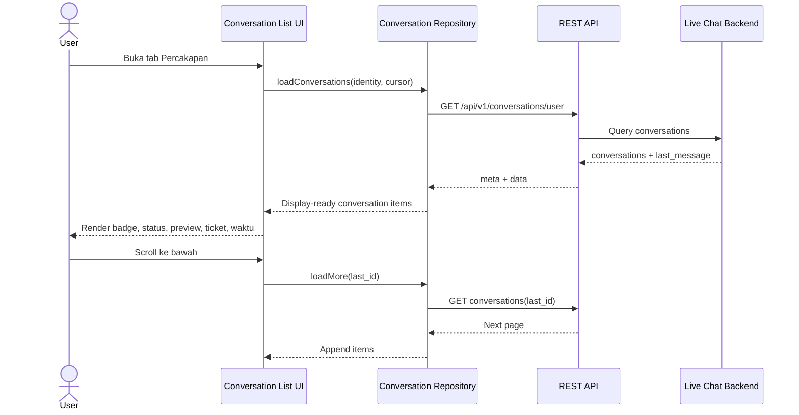

## 5. New Chat

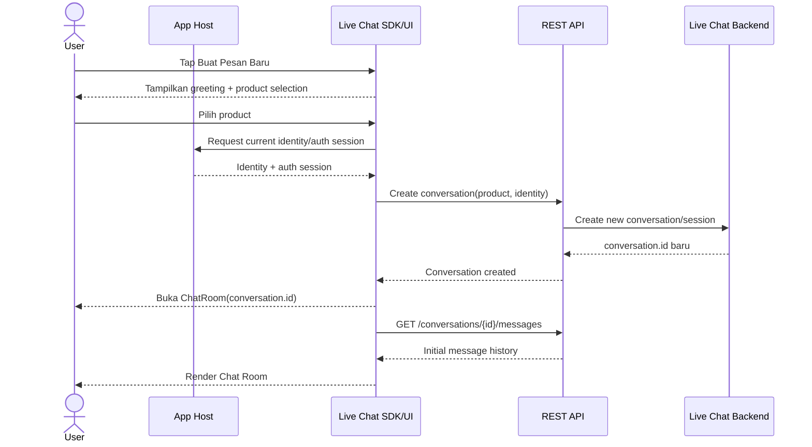

> Endpoint dan payload create conversation masih menunggu konfirmasi backend. Nama request pada diagram adalah logical operation, bukan kontrak final.

## 6. Continue Existing Conversation

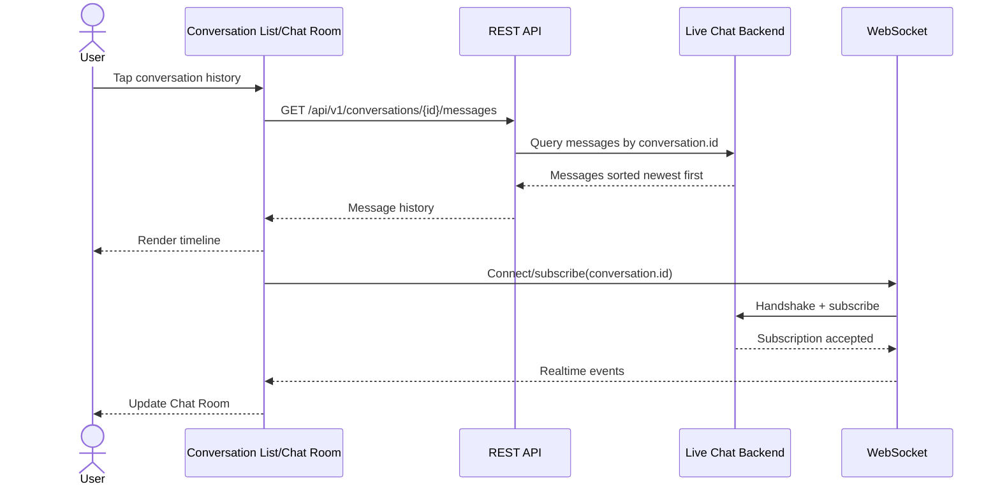

## 7. Send Message

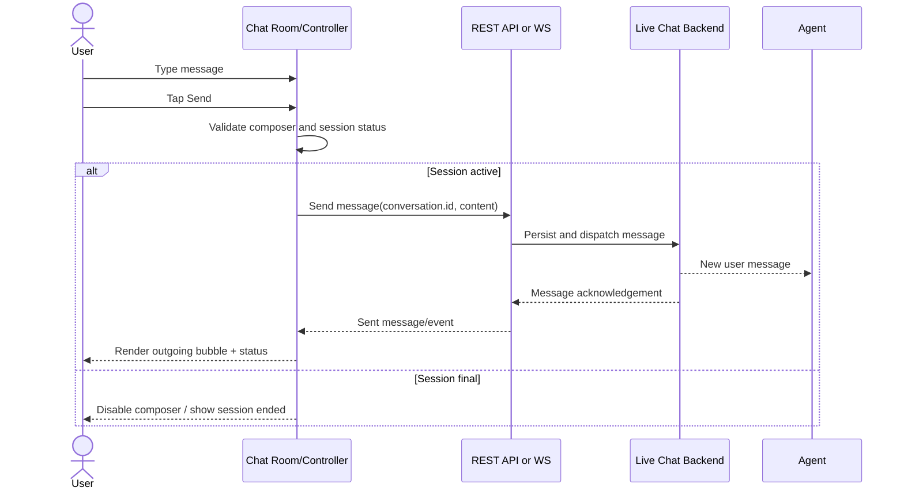

> Mekanisme send final—REST atau WebSocket—harus mengikuti kontrak backend yang belum tersedia lengkap.

## 8. Receive Agent Message and Local Notification

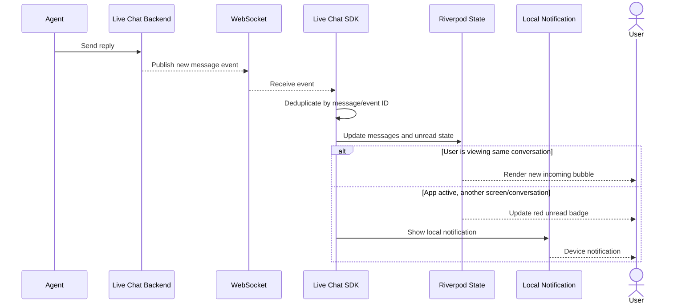

FCM/APNs tidak digunakan pada MVP. Jika app masuk background atau terminated, WebSocket/local notification tidak menjamin event diterima. Saat app aktif kembali, SDK melakukan resync via REST API.

## 9. WebSocket Disconnect and Resync

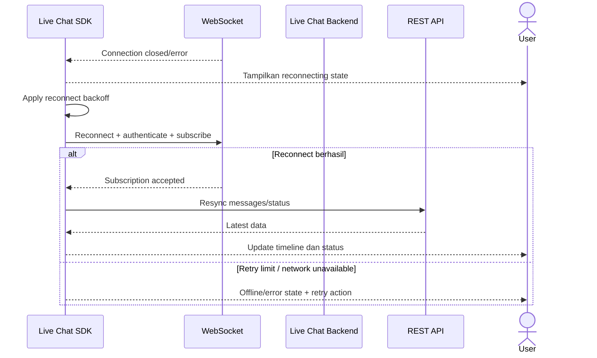

## 10. Conversation Status Changes

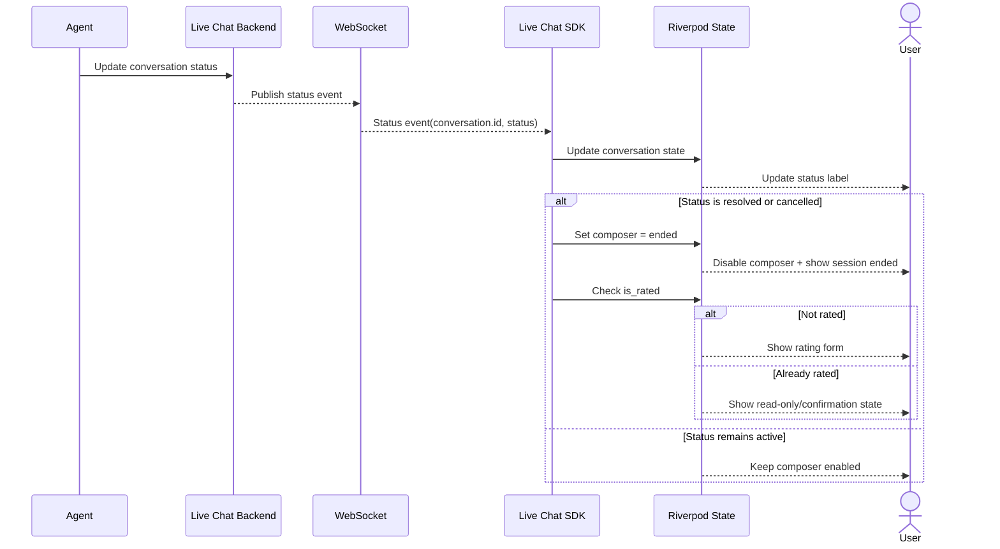

## 11. Attachment Flow

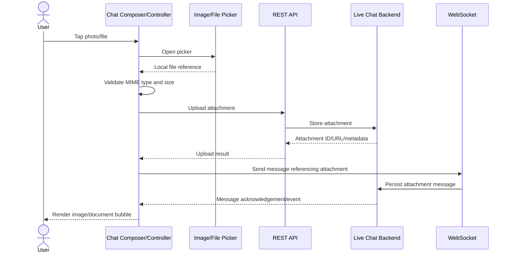

## 12. Rating Flow

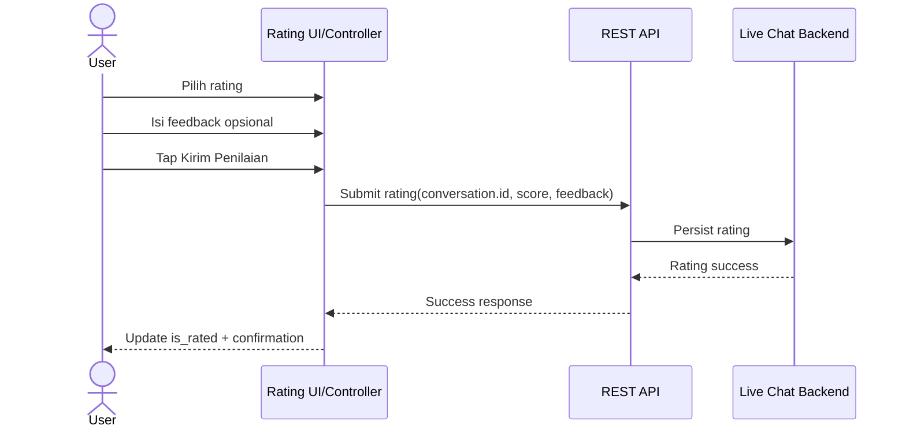

## 13. UI Boundary Summary

```text
User interaction
  ↓
Page/Controller
  ├─ Riverpod state
  ├─ Dio REST request
  ├─ WebSocket lifecycle
  ├─ Local notification
  └─ Navigation/side effect
  ↓
Section/Composite/Primitive
  ├─ Receive display-ready data
  ├─ Render visual state
  └─ Emit callback
```

Primitive dan composite component tidak boleh memanggil API, mengakses provider, membuka router, mengirim notification, atau membaca storage.

## 14. Pending Backend Contracts

Sequence yang masih membutuhkan konfirmasi backend:

- Create conversation dan product payload.
- Send message: REST atau WebSocket.
- WebSocket URL, handshake, authentication, dan subscribe.
- WebSocket event names dan payload.
- Message acknowledgement dan delivery/read event.
- Upload attachment.
- Submit rating.
- Article search/detail.

