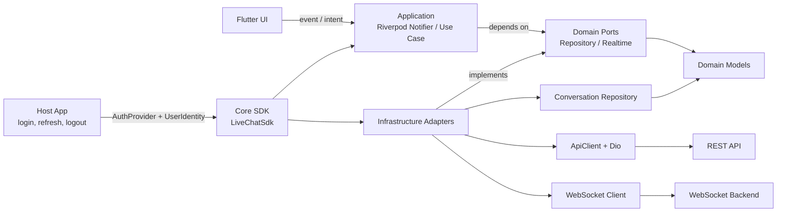
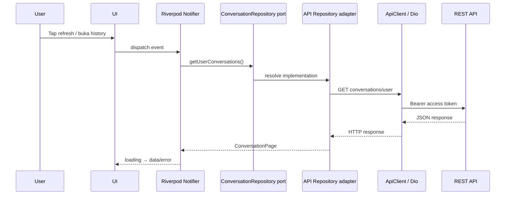

# Technical Requirements Document (TRD)

## Live Chat Flutter SDK

**Status:** Draft  
**Version:** 0.1.0  
**Related PRD:** `LIVE_CHAT_PRD.md`  
**Target:** Flutter Android and iOS  
**Distribution:** Internal/private Flutter package

Sequence diagram antar host app, SDK, REST API, WebSocket, backend, dan agent tersedia di `LIVE_CHAT_SEQUENCE_DIAGRAM.md`.

**Flutter version management:** FVM

**Current implementation status:** API/auth foundation in progress. The SDK
now has an instance-scoped `LiveChatSdk`, `ApiClient`, host-owned
`AuthProvider`, typed API exceptions, and a WebSocket boundary. Endpoint
repository parsing for user conversations and message history is now present.
The concrete WebSocket protocol remains integration work.

---

## 1. Purpose

Dokumen ini mendefinisikan rancangan teknis untuk implementasi Live Chat sebagai Flutter SDK reusable. TRD menerjemahkan kebutuhan pada PRD menjadi pilihan teknologi, arsitektur, kontrak internal, dan strategi implementasi.

## 2. Technical Goals

- Satu SDK dapat digunakan oleh beberapa project Flutter.
- Mendukung Android dan iOS.
- Memisahkan business logic dari UI.
- REST API menjadi source of truth.
- WebSocket digunakan untuk realtime messaging dan status event.
- Tidak menyimpan conversation atau message secara permanen di device.
- Auth session dapat diintegrasikan dengan sistem login aplikasi host.
- UI dapat digunakan langsung atau dikustomisasi oleh aplikasi host.

## 3. Proposed Technology Stack

| Area | Teknologi | Keputusan |
|---|---|---|
| Runtime | Flutter/Dart stable channel | Wajib |
| Packaging | Dart/Flutter package | Wajib |
| REST client | `dio` | Dipilih untuk interceptor, timeout, cancellation, dan multipart upload |
| WebSocket | `web_socket` | Pilihan awal; API konsisten lintas platform. Finalisasi setelah kontrak backend tersedia |
| Secure auth storage | `flutter_secure_storage` | Hanya jika SDK diberi tanggung jawab menyimpan auth session |
| State management internal | Riverpod | Dipakai di layer UI SDK, tidak diekspos sebagai kewajiban aplikasi host |
| JSON/model generation | `json_serializable` + `build_runner` | Mengurangi mapping manual dan menjaga model konsisten |
| Image picker | `image_picker` | Mengambil foto dari kamera/gallery |
| File picker | `file_picker` | Memilih dokumen dari device |
| Emoji | `emoji_picker_flutter` | Composer emoji |
| Foreground local notification | `flutter_local_notifications` | Menampilkan notifikasi device dari event realtime saat app aktif |
| Testing | `flutter_test`, `mocktail`, `integration_test` | Unit, contract, widget, dan integration test |
| Static analysis | `dart analyze`, `dart format`, lint rules | Wajib pada CI |

Package yang digunakan harus dikunci melalui `pubspec.lock` pada example/app consumer dan diperbarui secara terkontrol. Versi dependency final ditentukan saat bootstrap project dan harus kompatibel dengan Flutter stable yang dipilih.

`dio` menyediakan konfigurasi global, interceptor, timeout, cancellation, transformer, serta multipart upload. `web_socket` menyediakan API WebSocket lintas implementasi Flutter/Dart. Dokumentasi Flutter juga membedakan reusable Dart package dari plugin package; implementasi awal ini diprioritaskan sebagai package Dart/Flutter karena kebutuhan utamanya adalah API, WebSocket, UI, dan file picker.

`flutter_local_notifications` digunakan untuk local notification yang dipicu oleh aplikasi saat proses aplikasi aktif. FCM/APNs tidak digunakan pada scope MVP. Karena itu, notifikasi background/terminated tidak dijamin diterima.

## 4. Package Architecture

Implementasi awal menggunakan satu repository dengan pemisahan public API, core, dan UI:

```text
live_chat_sdk/
├── lib/
│   ├── live_chat_sdk.dart
│   └── src/
│       ├── core/
│       │   ├── auth/
│       │   ├── config/
│       │   ├── errors/
│       │   └── sdk/
│       ├── domain/
│       │   ├── models/
│       │   └── ports/
│       ├── application/
│       │   └── state/
│       ├── infrastructure/
│       │   ├── network/
│       │   └── repositories/
│       ├── ui/
│       │   ├── articles/
│       │   ├── chat_room/
│       │   ├── conversation_list/
│       │   ├── new_conversation/
│       │   └── rating/
│       └── shared/
├── test/
├── integration_test/
├── example/
├── README.md
├── CHANGELOG.md
└── pubspec.yaml
```

Public export hanya melalui `lib/live_chat_sdk.dart`. Class internal tidak boleh di-import oleh aplikasi host melalui path `src`.

UI component mengikuti `LIVE_CHAT_UI_DESIGN.md` dan guideline component internal. Tabs dibuat sebagai custom component internal tanpa library eksternal; bubble menggunakan renderer berdasarkan content type agar dapat diperluas.

### 4.1 Project Type and Runnable Host

Repository ini menggunakan **Flutter package project**, bukan Flutter application project biasa.

Perbedaannya:

| Flutter app biasa | Live Chat SDK repository |
|---|---|
| Root memiliki `lib/main.dart` | Root memiliki public package API dan source SDK |
| Root dapat langsung menjalankan `flutter run` | Root package tidak dijalankan sebagai aplikasi |
| UI dan business flow milik satu aplikasi | SDK dipakai oleh banyak aplikasi host |
| Android/iOS folders berada di root | Android/iOS runner berada di `example/` |
| Tidak selalu punya example app | Wajib memiliki `example/` sebagai development host |

Struktur runtime:

```text
live_chat_sdk/
├── lib/                  # Source SDK dan public API
├── test/                 # Unit/widget/golden tests package
├── integration_test/    # Test flow example/host bila diperlukan
├── example/              # Flutter application yang menjalankan SDK
│   ├── android/
│   ├── ios/
│   ├── lib/main.dart
│   └── pubspec.yaml
├── pubspec.yaml
└── .fvmrc
```

SDK awal tetap berupa Flutter/Dart package meskipun menggunakan dependency plugin seperti image picker, file picker, dan local notification. Repository baru perlu menjadi Flutter plugin hanya jika kita menulis native platform code sendiri.

Struktur package saat ini:

```text
lib/src/
├── core/
│   ├── auth/auth_provider.dart
│   ├── config/live_chat_config.dart
│   ├── errors/live_chat_exception.dart
│   └── sdk/live_chat_sdk.dart
├── domain/
│   ├── models/chat_models.dart
│   └── ports/
│       ├── conversation_api.dart
│       ├── conversation_repository.dart
│       └── realtime_chat_client.dart
├── application/
│   └── state/live_chat_fixture_providers.dart
├── infrastructure/
│   ├── network/
│   │   ├── api_client.dart
│   │   └── token_coordinator.dart
│   └── repositories/conversation_repository.dart
└── ui/
    ├── live_chat_page.dart
    ├── articles/article_page.dart
    ├── chat_room/chat_room_components.dart
    ├── conversation_list/conversation_list_page.dart
    ├── new_conversation/
    │   ├── new_conversation_page.dart
    │   └── product_icon.dart
    ├── rating/rating_section.dart
    └── shared/
        ├── agent_avatar.dart
        ├── live_chat_header.dart
        └── live_chat_tabs.dart
```

`core` berisi shared SDK foundation, lifecycle, konfigurasi, auth contract, dan
typed errors. `domain` berisi model dan port/interface yang tidak bergantung
pada API implementation. `application` berisi orchestration/state feature. `infrastructure`
berisi adapter Dio, repository API, konfigurasi transport, dan implementasi
teknis lainnya. `ui` berisi widget dan page Flutter. `live_chat_sdk.dart`
menjadi composition root yang menghubungkan semua layer.

`live_chat_page.dart` hanya mengorkestrasi page-level state dan navigation.
Model message menggunakan ordered `List<MessageContent>` dengan renderer per
content block dan fallback unsupported content. Fixture provider dipisahkan
agar nantinya dapat diganti controller/repository tanpa mengubah kontrak
component.

#### FVM commands

```bash
fvm install
fvm flutter pub get
fvm flutter test
fvm flutter analyze

cd example
fvm flutter pub get
fvm flutter run
```

`example/` berfungsi sebagai host app development untuk mock auth, preview UI, mock/live API environment, dan pengujian Android/iOS. Aplikasi kantor yang sebenarnya menjadi host terpisah pada tahap integrasi.

## 5. Layered Architecture

### 5.1 Architecture flow — Ports & Adapters



Aturan dependency utama:

```text
UI → Application → Domain Ports ← Infrastructure
                         ↑
                    Domain Models

Core SDK menghubungkan dependency melalui composition root.
```

Domain tidak boleh mengimpor Dio, Flutter, WebSocket package, atau detail
endpoint. Infrastructure boleh bergantung pada domain contract, tetapi domain
tidak boleh bergantung balik pada infrastructure implementation.

### 5.2 Runtime request flow



### 5.3 Composition and user lifecycle

```mermaid
flowchart TD
    Login[Host login] --> Session[Host auth session]
    Session --> Identity[UserIdentity]
    Session --> Provider[AuthProvider]
    Identity --> SDK[Create LiveChatSdk]
    Provider --> SDK
    SDK --> Repositories[Identity-aware repositories]
    SDK --> Client[Instance-scoped ApiClient]
    Logout[Host logout / user switch] --> Dispose[await sdk.dispose()]
    Dispose --> New[Create SDK instance for next user]
```

```text
Host Flutter App
       │
       ▼
Public SDK API / Widgets
       │
       ▼
Presentation State (Riverpod)
       │
       ▼
Use Cases / Repositories
       │
       ├── REST Data Source (Dio)
       └── Realtime Data Source (WebSocket)
       │
       ▼
Backend Live Chat API
```

### 5.1 Host integration layer

Aplikasi host bertanggung jawab atas:

- Login user.
- Refresh token jika login system memilikinya.
- Menyediakan email/user ID.
- Menyediakan auth token atau callback untuk mengambil token terbaru.
- Menentukan branding atau konfigurasi UI yang diizinkan.

SDK tidak boleh mengasumsikan implementasi login tertentu.

### 5.2 Core layer

Core layer bertanggung jawab atas:

- API client.
- Auth header injection.
- Request/response mapping.
- Pagination cursor.
- Conversation/message repository.
- WebSocket connection lifecycle.
- Typed error.
- In-memory state selama fitur aktif.

Core layer tidak boleh bergantung pada widget Flutter.

### 5.3 UI layer

UI layer menyediakan screen/widget untuk:

- Conversation list.
- New conversation/product selection.
- Chat room.
- Article tab.
- Rating.

UI layer hanya menggunakan repository/use case, bukan memanggil Dio atau WebSocket secara langsung.

## 6. Public SDK API

Contoh konfigurasi yang diinginkan:

```dart
final liveChat = LiveChatSdk(
  config: LiveChatConfig(
    restBaseUrl: 'https://api.example.com/live-chat-service',
    websocketUrl: 'wss://api.example.com/live-chat-service',
  ),
  identityProvider: HostIdentityProvider(
    email: loggedInUser.email,
    userId: loggedInUser.id,
  ),
  authProvider: authProvider,
);
```

Public API minimum:

```text
LiveChatSdk
LiveChatConfig
AuthProvider
UserIdentity
ConversationRepository
MessageRepository
RealtimeChatClient
Conversation
ConversationMessage
ConversationStatus
MessageContent
```

SDK harus menyediakan mode headless/core-only agar aplikasi host dapat membuat UI sendiri tanpa memakai widget bawaan.

## 7. Domain Models

Model domain mengikuti response Swagger, bukan screenshot UI.

### Conversation

```text
id: String
status: ConversationStatus
ticketNumber: int?
isRated: bool
lastMessage: LastMessage?
```

### ConversationMessage

```text
id: String
conversationId: String
sender: Sender
message: List<MessageContent>
status: MessageStatus
readAt: DateTime?
createdAt: DateTime
```

### Sender

```text
id: int
email: String
photoProfileUrl: String?
fullName: String
isAgent: bool
position: String?
```

### MessageContent

```text
type: MessageType // text, image, document
content: String
meta: MessageMeta?
```

### MessageMeta

```text
fileName: String?
extension: String?
size: int?
```

Enum harus memiliki fallback `unknown` agar message baru dari backend tidak membuat aplikasi gagal parse.

UI tidak menggunakan domain model API secara langsung. Mapper mengubah domain model menjadi display-ready data seperti `ConversationCardData` dan `MessageBubbleData` sebelum diteruskan ke component.

## 8. REST API Integration

API client menggunakan satu instance Dio per SDK instance dengan:

- Base URL configurable per environment.
- Connect, receive, dan send timeout.
- Auth interceptor.
- Correlation/request ID jika didukung backend.
- Typed response parsing.
- Redacted logging hanya pada mode development.
- Mapping HTTP error ke `LiveChatException`.

Endpoint yang sudah teridentifikasi:

| Kebutuhan | Method | Endpoint |
|---|---:|---|
| User conversations | GET | `/api/v1/conversations/user` |
| Admin conversations | GET | `/api/v1/conversations` |
| Online agents | GET | `/api/v1/users/agents/online` |
| Messages | GET | `/api/v1/conversations/{id}/messages` |
| Timeline | GET | `/api/v1/conversations/{id}/timeline` |

Scope mobile user memprioritaskan endpoint user conversation dan messages. Endpoint admin tidak boleh dipakai oleh aplikasi user kecuali authorization backend memang mengizinkannya.

API wrapper memiliki bentuk umum:

```json
{
  "meta": {},
  "data": []
}
```

### Pagination

- Conversation list memakai `limit` dan `last_id`.
- Message list memakai `limit` dan `last_id`.
- Repository mengembalikan page data dan cursor berikutnya.
- UI tidak boleh mengelola cursor secara langsung.

Implementasi awal tersedia melalui `ConversationRepository` untuk:

- `GET /api/v1/conversations/user`
- `GET /api/v1/conversations/{id}/messages`

Mapper menerima response envelope `meta` + `data`, mengubah status/message
menjadi domain model, dan mengembalikan cursor item terakhir.

## 9. Authentication Design

Default design: auth dikelola aplikasi host, SDK hanya meminta token saat diperlukan.

```dart
abstract interface class AuthProvider {
  Future<String?> getAccessToken({bool forceRefresh = false});
}
```

`forceRefresh: true` meminta host menjalankan refresh token sesuai mekanisme
auth-nya. Refresh token dan credential storage tidak pernah dimiliki SDK.

Untuk example app Affiliate environment dev, `DemoPartnerAuthClient` di dalam
`example/` menggunakan
server URL `https://dev.affiliate-api.komerce.my.id` dengan endpoint
`POST /api/v1/auth/login`. Payload mengikuti Web Client Affiliate:
`username_email`, `password`, dan `fcm_token`. Token dibaca dari
`data.access_token`. `fcm_token` wajib dikirim oleh service Affiliate; pada
example digunakan placeholder non-push. Host production sebaiknya memasukkan
FCM token device yang aktual melalui client/auth adapter-nya sendiri.

`LiveChatSdk` dibuat satu kali untuk satu user identity. Saat logout atau
user switch, host harus memanggil `dispose()` lalu membuat instance baru agar
REST client, realtime connection, dan state memory user lama ikut dibersihkan.

```dart
final sdk = LiveChatSdk(
  config: config,
  authProvider: hostAuthProvider,
  identity: UserIdentity(userId: user.id, email: user.email),
);

// Saat logout atau berganti user:
await sdk.dispose();
```

Keuntungan:

- SDK tidak terikat sistem login tertentu.
- Token refresh tetap dimiliki aplikasi utama.
- Tidak ada kredensial statis di package.
- Beberapa aplikasi dapat memakai mekanisme auth masing-masing.

Jika kebutuhan produk mengharuskan SDK menyimpan token, gunakan adapter `flutter_secure_storage`. Penyimpanan tersebut hanya untuk auth session, bukan conversation/message atau cache chat.

## 10. WebSocket Design

WebSocket bertanggung jawab atas realtime event, bukan sebagai database message.

Lifecycle yang direncanakan:

```text
Chat Room opened
  ↓
Load history via REST
  ↓
Connect WebSocket
  ↓
Authenticate/subscribe conversation
  ↓
Receive/send realtime events
  ↓
Update in-memory state
  ↓
Chat Room closed
  ↓
Unsubscribe/close connection
```

Aturan teknis:

- Satu active conversation dapat memiliki satu realtime subscription.
- Reconnect tidak membuat conversation baru.
- Setelah reconnect, SDK melakukan resync melalui REST untuk mencegah message terlewat.
- Duplicate event dideduplikasi berdasarkan `message.id` atau event ID.
- Event yang tidak dikenal dicatat sebagai `unknown event`, bukan menyebabkan stream berhenti.
- Backoff reconnect dan batas percobaan ditentukan pada implementasi final.

### Current boundary and blocker

Boundary yang sudah tersedia:

```dart
abstract interface class RealtimeChatClient {
  Stream<RealtimeEvent> get events;
  Future<void> connect({required String conversationId});
  Future<void> disconnect();
  Future<void> dispose();
}
```

Implementasi default saat ini adalah no-op agar UI dan API foundation dapat
ditest tanpa menebak protokol backend.

URL WebSocket, handshake, auth mechanism, event name, subscribe payload, send payload, ack, read event, dan status event belum tersedia secara lengkap pada OpenAPI YAML. Implementasi WebSocket tidak boleh difinalisasi sebelum kontrak tersebut diberikan atau diobservasi dari web client secara resmi.

## 11. Conversation Session Strategy

Session bisnis direpresentasikan oleh `conversation.id`.

```text
New Chat        → create conversation → conversation.id baru
Open History    → gunakan conversation.id lama
Reconnect WS    → tetap conversation.id yang sama
Final status    → session ditutup secara bisnis
```

Session state runtime tidak disimpan sebagai data permanen. State seperti `isConnected`, `isLoading`, dan `pendingMessage` hanya hidup selama instance SDK/Chat Room aktif.

## 12. Notification Strategy

Notifikasi dibagi menjadi dua jalur:

```text
WebSocket message event
  ├── Update in-app unread badge
  └── If app active and chat not open → local notification

App background/terminated
  └── No guaranteed notification in MVP; REST resync when app active again
```

### 12.1 In-app unread badge

- Sumber event utama: WebSocket.
- Sumber validasi/resync: REST API.
- State disimpan di memory selama SDK aktif.
- Saat user membuka conversation, SDK melakukan refresh/sync unread state sesuai endpoint backend.
- Badge tidak boleh hanya bergantung pada local counter yang tidak pernah divalidasi.

### 12.2 Foreground local notification

Ketika aplikasi aktif dan WebSocket menerima message baru:

1. Parse event dan identifikasi `conversation_id`.
2. Deduplicate menggunakan message/event ID.
3. Update conversation/message state.
4. Jika conversation tidak sedang dibuka, panggil notification service.
5. Payload notification menyertakan `conversation_id` dan dapat menyertakan `ticket_number`.

Notification service harus diabstraksikan:

```dart
abstract interface class NotificationService {
  Future<void> showNewMessage(NewMessageNotification notification);
}
```

Hal ini memungkinkan aplikasi host mengganti implementasi notification atau menonaktifkan local notification.

### 12.3 Background/terminated behavior

- FCM/APNs tidak digunakan pada MVP.
- WebSocket hanya dipertahankan selama aplikasi dan SDK masih aktif.
- Jika OS menghentikan proses atau memutus koneksi, tidak ada jaminan local notification muncul.
- Saat user membuka aplikasi kembali, SDK melakukan refresh conversation/message dari REST API.
- Push notification dapat ditambahkan sebagai extension terpisah jika kebutuhan berubah.

Local notification dari WebSocket hanya dianggap best-effort untuk foreground/active process.

## 13. Local Data Policy

### Tidak boleh dipersistenkan

- Conversation list.
- Message history.
- Last message.
- Status conversation.
- Online agent list.
- Attachment metadata.
- Rating state.

### Boleh dipersistenkan

- Access token/refresh token bila disepakati dengan host app.
- Auth session metadata minimum.

Memory cache boleh digunakan selama layar aktif untuk mencegah rebuild berlebihan. Cache memory harus dibuang saat SDK dispose atau user logout.

## 14. File and Media Handling

Flow attachment:

```text
Tap attachment
  ↓
Choose photo/file
  ↓
Validate type and size
  ↓
Upload to backend
  ↓
Receive attachment identifier/URL
  ↓
Send message referencing attachment
  ↓
Render message from API response
```

File path lokal tidak boleh dikirim langsung sebagai message. Batas ukuran, MIME type, endpoint upload, dan response upload menunggu konfirmasi backend.

## 15. State Management

Riverpod digunakan internal pada UI package untuk mengelola:

- Conversation list state.
- Pagination state.
- Active conversation state.
- Message history state.
- WebSocket connection state.
- Composer state.
- Upload state.
- Rating state.

State harus memiliki minimal status:

```text
initial
loading
refreshing
loaded
loadingMore
submitting
success
empty
error
ended
```

Core layer tetap dapat digunakan tanpa Riverpod melalui repository dan stream/API publik.

## 16. Error Handling

Gunakan error type terstruktur:

```text
AuthException
NetworkException
TimeoutException
ApiException
ValidationException
ConversationNotFoundException
ConversationEndedException
WebSocketException
UploadException
UnknownLiveChatException
```

UI memetakan error menjadi pesan user-friendly, sedangkan detail teknis hanya tersedia untuk logging development/observability.

## 17. Android and iOS Requirements

- SDK wajib diuji pada Android dan iOS.
- Semua request API menggunakan HTTPS.
- WebSocket production menggunakan WSS.
- Permission kamera/gallery/file mengikuti kebutuhan plugin dan kebijakan aplikasi host.
- Keyboard dan safe area harus ditangani oleh Chat Room.
- WebSocket tidak dijadikan mekanisme background notification.
- Local notification foreground menggunakan `flutter_local_notifications`.
- Android notification permission/channel dan iOS notification permission harus dikonfigurasi oleh aplikasi host.

### 17.1 One-time SDK installation per host app

Setiap aplikasi Flutter yang memakai SDK cukup menambahkan dependency satu kali pada `pubspec.yaml`. Semua fitur SDK kemudian dapat digunakan dari berbagai halaman/feature di aplikasi tersebut tanpa memasang dependency ulang.

```yaml
dependencies:
  live_chat_sdk:
    git:
      url: git@github.com:nunutech40/livechatmobileappnative.git
```

Dependency yang sama tetap perlu di-resolve pada setiap aplikasi host yang berbeda. Konfigurasi native juga berlaku per aplikasi host, bukan satu kali secara global untuk seluruh kantor.

### 17.2 Android configuration

Konfigurasi yang perlu disiapkan sesuai fitur yang dipakai:

| Kebutuhan | Konfigurasi Android |
|---|---|
| Local notification | Notification channel dan permission `POST_NOTIFICATIONS` pada Android 13+ |
| Camera | Camera permission bila user memilih ambil foto dari kamera |
| Gallery/photo | Permission mengikuti versi Android dan implementation picker |
| File | File picker/provider configuration bila diperlukan |
| HTTPS/WSS | Tidak boleh memakai cleartext HTTP/WS untuk environment production |

### 17.3 iOS configuration

Konfigurasi yang perlu disiapkan sesuai fitur yang dipakai:

| Kebutuhan | Konfigurasi iOS |
|---|---|
| Local notification | Request notification permission dan notification presentation settings |
| Camera | `NSCameraUsageDescription` pada `Info.plist` |
| Photo library | `NSPhotoLibraryUsageDescription` pada `Info.plist` bila diperlukan oleh picker |
| File | UIDocumentPicker/picker configuration sesuai implementation |
| HTTPS/WSS | App Transport Security dan secure endpoint untuk production |

### 17.4 Host app responsibility

Aplikasi host bertanggung jawab untuk:

- Menjalankan inisialisasi Flutter binding sebelum plugin dipakai.
- Menyediakan auth provider dan user identity.
- Meminta permission native pada timing UX yang tepat.
- Menyediakan icon/channel/branding notification yang diperlukan.
- Menangani lifecycle aplikasi dan membuka Chat Room ketika local notification ditekan.
- Menguji konfigurasi pada device Android dan iOS nyata.

SDK menyediakan abstraction dan dokumentasi setup, tetapi tidak boleh mengubah konfigurasi native aplikasi host secara diam-diam.

#### Attachment permission flow

Untuk MVP, SDK menggunakan `image_picker` dengan sumber gallery/photo library. SDK memanggil picker ketika user menekan `Tambah Foto`; host app tetap menjadi pemilik konfigurasi native dan OS yang menampilkan permission prompt bila diperlukan.

- Android: system photo picker digunakan pada versi yang mendukungnya; SDK tidak meminta permission storage secara manual untuk gallery MVP.
- iOS: host app wajib menyediakan `NSPhotoLibraryUsageDescription` di `Info.plist`.
- Jika user membatalkan picker, SDK tidak menampilkan error.
- Jika picker gagal atau permission ditolak, SDK menangkap error dan menampilkan state/error yang dapat diteruskan ke host app.
- File picker menggunakan system document picker Android/iOS; umumnya tidak memerlukan permission storage manual.
- Kamera belum diaktifkan pada MVP. Jika ditambahkan, host wajib menyediakan `NSCameraUsageDescription` dan konfigurasi camera Android.

## 18. Testing Strategy

### Unit tests

- JSON model parsing.
- Enum fallback.
- API repository mapping.
- Cursor pagination.
- Auth interceptor.
- Session lifecycle.
- Message deduplication.
- Reconnect policy.

### Contract tests

- Response conversation sesuai OpenAPI example/schema.
- Response message sesuai `ConversationMessageItem`.
- Attachment metadata sesuai `MessageMeta`.
- Error response backend dapat dipetakan.

### Widget tests

- Tab navigation.
- Conversation list states.
- New chat product selection.
- Active/final conversation behavior.
- Message bubbles.
- Attachment menu.
- Emoji composer.
- Rating form.

### Integration tests

- Login session injection.
- Fetch conversation list.
- Open history conversation.
- Create new conversation.
- Send/receive message melalui mocked WebSocket.
- Reconnect and resync.
- Final status disables composer.

### Notification tests

- WebSocket message memperbarui unread badge.
- Message pada conversation yang sedang aktif tidak memunculkan duplicate notification.
- Message pada conversation lain memunculkan local notification saat app foreground.
- Event/message yang sama tidak menghasilkan notification lebih dari sekali.
- Tap notification membawa user ke conversation yang benar.
- Background/terminated behavior diuji sebagai expected limitation pada device nyata.

## 19. Observability and Logging

Development logging boleh mencatat:

- Request method/path tanpa token.
- Response status code.
- WebSocket lifecycle.
- Reconnect reason.
- Error category.

Production logging tidak boleh mencatat:

- Access token atau refresh token.
- Password.
- Isi message lengkap.
- File content.
- Data pribadi yang tidak diperlukan.

SDK menyediakan optional logger interface agar aplikasi host dapat menghubungkan logging ke sistem mereka.

## 20. Distribution and Versioning

SDK didistribusikan sebagai private Git dependency atau private Dart package registry.

Semantic versioning:

- Major: breaking public API atau behavior.
- Minor: fitur baru yang backward-compatible.
- Patch: bug fix dan perubahan internal.

Setiap release harus memiliki:

- Changelog.
- Version tag.
- Test result.
- Compatibility note.
- Migration guide jika ada breaking change.

## 21. CI/CD Requirements

Pipeline minimum:

```text
Checkout
  ↓
flutter pub get
  ↓
dart format --set-exit-if-changed
  ↓
dart analyze
  ↓
flutter test
  ↓
integration test
  ↓
Build example Android/iOS
  ↓
Publish private package/release tag
```

CI tidak boleh menggunakan kredensial admin yang tersimpan di repository.

## 22. Environment Configuration

Environment minimal:

```text
development
staging
production
```

Konfigurasi yang dapat diubah per aplikasi:

- REST base URL.
- WebSocket URL.
- Timeout.
- Logging mode.
- Upload limits setelah backend mengonfirmasi.
- Branding/UI theme.
- Feature flags.

Tidak ada URL atau token production yang di-hardcode pada source code SDK.

## 23. Technical Risks

| Risiko | Dampak | Mitigasi |
|---|---|---|
| Kontrak WebSocket belum lengkap | Realtime tidak dapat difinalisasi | Minta event contract atau lakukan network inspection resmi |
| Endpoint create/send/rating belum jelas | Flow New Chat belum dapat diuji end-to-end | Lengkapi API contract sebelum implementasi final |
| Token dikelola berbeda tiap aplikasi | Integrasi SDK tidak konsisten | Gunakan `AuthProvider` abstraction |
| API response berubah | Parsing/error runtime | Contract test dan enum fallback |
| App masuk background | WebSocket putus dan local notification tidak muncul | Terima sebagai batasan MVP; lakukan REST resync saat app aktif kembali |
| Duplicate realtime/push event | User menerima notif ganda | Dedup berdasarkan message/event ID dan conversation state |
| File upload berbeda antarplatform | Attachment gagal | Gunakan abstraction picker dan validasi MIME/size |
| Dependency conflict antarproject | Build gagal | Public API minim, dependency version policy, example app CI |

## 24. Implementation Order

1. Bootstrap package dan example app.
2. Definisikan public config, identity, auth provider, dan error types.
3. Implementasi domain models berdasarkan Swagger.
4. Implementasi REST conversation list dan message history.
5. Implementasi UI tab dan conversation list.
6. Implementasi new chat/product selection setelah endpoint tersedia.
7. Implementasi Chat Room dengan REST history.
8. Implementasi send message dan attachment setelah API contract tersedia.
9. Implementasi WebSocket setelah event contract tersedia.
10. Implementasi session ending dan rating.
11. Implementasi artikel.
12. Testing, documentation, packaging, dan private release.

## 25. Open Technical Decisions

Keputusan berikut belum boleh dianggap final:

- Versi minimum Flutter/Dart.
- Final WebSocket package setelah handshake diuji.
- Detail Riverpod exposure dan provider lifecycle.
- Endpoint create conversation.
- Endpoint send message.
- Endpoint upload attachment.
- Endpoint rating.
- Apakah push notification akan ditambahkan sebagai extension di masa depan.
- Private package registry versus private Git dependency.
