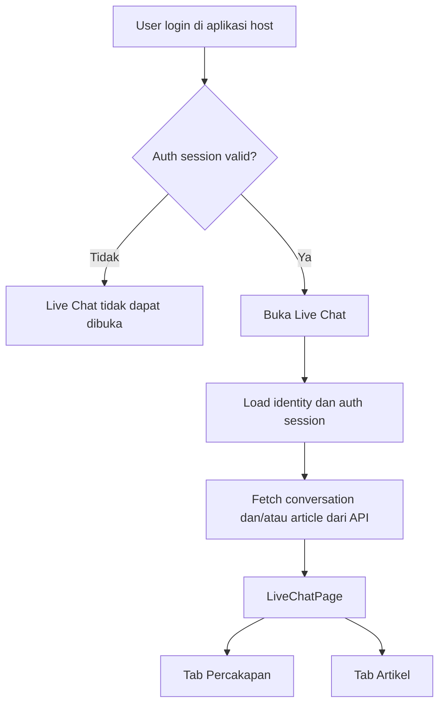
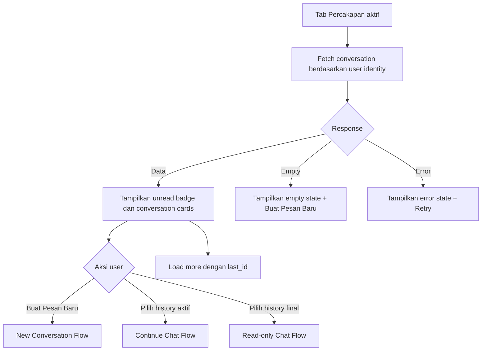
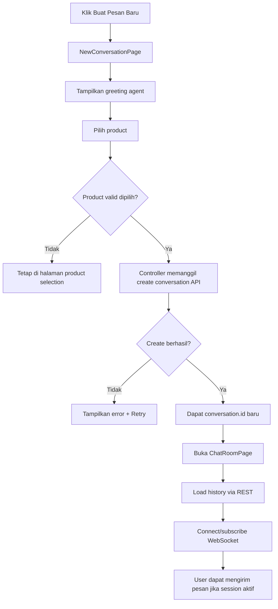
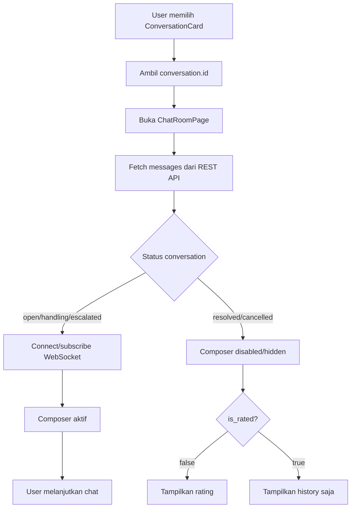
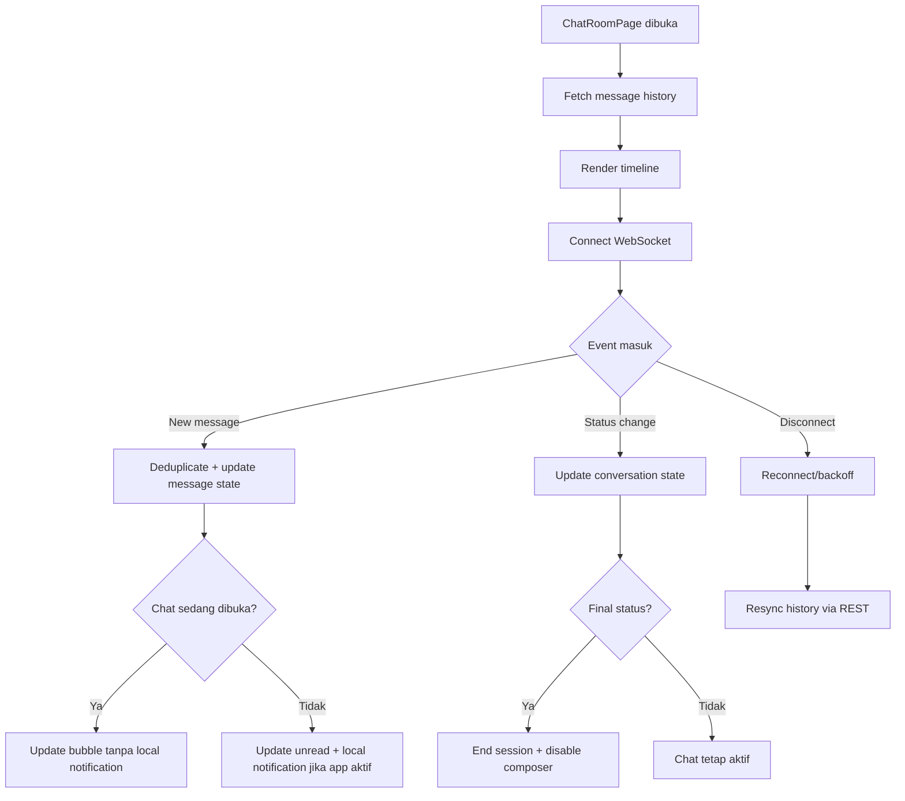
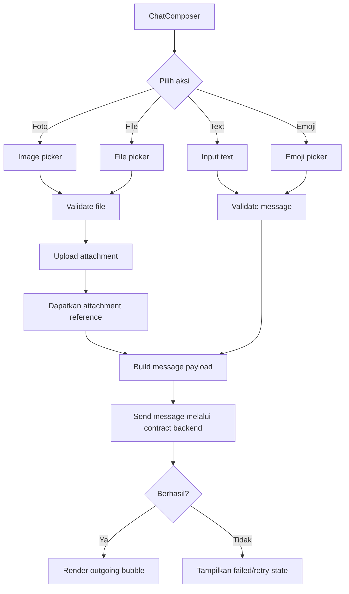
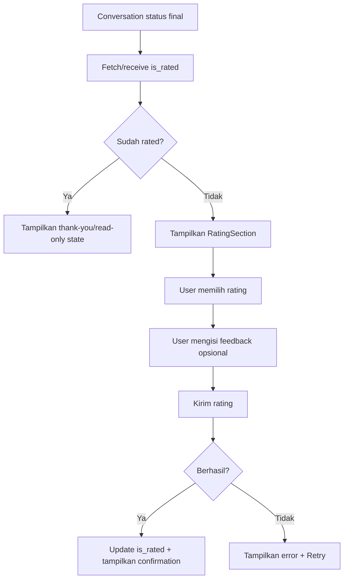

# Live Chat UI Flow

**Status:** Draft  
**Version:** 0.1.0  
**Related documents:** `LIVE_CHAT_PRD.md`, `LIVE_CHAT_TRD.md`, `LIVE_CHAT_UI_DESIGN.md`

Interaksi antar actor dan backend dijelaskan lebih detail di `LIVE_CHAT_SEQUENCE_DIAGRAM.md`.

---

## 1. Purpose

Dokumen ini menggabungkan flowchart behavior dengan UI flow sebagai acuan implementasi layar Live Chat Flutter.

Flowchart menjelaskan alur dan keputusan bisnis. UI flow menjelaskan layar, komponen, state, dan referensi visual dari screenshot yang diberikan.

Screenshot digunakan sebagai visual reference untuk layout, warna, spacing, card, header, tabs, bubble, composer, dan rating. Screenshot bukan sumber kebenaran untuk field API atau status backend.

## 2. Overall Entry Flow



## 3. Conversation Tab Flow



## 4. New Conversation Flow



`conversation.id` baru menandai session bisnis baru. WebSocket reconnect tidak membuat conversation baru.

## 5. Continue History Flow



## 6. Chat Room Flow



## 7. New Message and Attachment Flow



Endpoint dan payload create/send/upload masih menunggu konfirmasi backend.

## 8. Rating Flow



## 9. UI Screen Inventory

| Screen/Section | Tujuan | Screenshot reference |
|---|---|---|
| `LiveChatPage` | Shell, header, tab, dan overlay/panel | Semua screenshot |
| `ConversationListPage` | New chat entry dan history list | Screenshot conversation list |
| `NewConversationPage` | Greeting dan pilihan product | Screenshot pilihan Komads–Komtim |
| `ChatRoomPage` | Timeline, composer, attachment, emoji | Screenshot chat room |
| `ConversationEndedSection` | Menandai session selesai | Screenshot “Sesi obrolan telah berakhir” |
| `RatingSection` | Rating dan feedback | Screenshot rating |
| `ArticlePage` | Search dan popular articles | Screenshot tab Artikel |

## 10. Visual Reference Mapping

### Conversation List

Elemen yang terlihat:

- Header orange Komerce.
- Tombol close.
- Segmented tab Percakapan/Artikel.
- Badge jumlah unread.
- Card greeting “Agent kami siap membalas pesanmu secepatnya”.
- CTA “Buat Pesan Baru”.
- Section “Baru-baru ini”.
- Conversation card dengan status, preview message, ticket number, waktu/tanggal, dan chevron.

### New Conversation

Elemen yang terlihat:

- Tombol back.
- Greeting dari Customer Service Agent.
- Daftar pilihan product.
- Icon dan chevron per product.

### Chat Room

Elemen yang terlihat:

- Header dengan back dan close.
- Date separator.
- Incoming/outgoing bubble.
- Avatar sender.
- Timestamp.
- Delivery/read indicator.
- Composer text.
- Attachment button.
- Emoji button dan picker.
- Send button.

### Ended Conversation and Rating

Elemen yang terlihat:

- Pesan sesi berakhir.
- Rating emoji 1–5.
- Feedback opsional.
- Tombol kirim penilaian.
- Confirmation setelah rating diterima.

## 11. UI State Matrix

| Area | States |
|---|---|
| Live Chat entry | authenticated, unauthenticated, auth expired |
| Conversation list | initial, loading, loaded, empty, loading more, error |
| New conversation | idle, product selected, submitting, error |
| Chat room | loading history, loaded, connecting, connected, reconnecting, error |
| Composer | enabled, disabled, sending, uploading, ended |
| Message bubble | incoming, outgoing, system, unsupported, failed |
| Attachment | selecting, validating, uploading, uploaded, failed |
| Rating | available, submitting, submitted, error |
| Article | loading, loaded, empty, searching, error |

## 12. Component Boundary Rules

```text
Page / Controller
  ├── API/Dio
  ├── Riverpod
  ├── WebSocket
  ├── Navigation
  ├── Notification
  └── Side effects

Section / Composite / Primitive
  ├── Display-ready input
  ├── Explicit visual state
  └── Callback event
```

Tidak boleh ada `ConversationCard` atau `MessageBubble` yang memanggil API, provider, repository, router, notification, atau storage secara langsung.

## 13. Recommended Deliverables Before Coding

1. Finalize visual tokens: color, spacing, radius, typography, icon size, shadow.
2. Confirm screenshot dimensions and responsive behavior.
3. Confirm product icon assets.
4. Confirm exact API contract untuk create conversation, send message, attachment, rating, dan WebSocket.
5. Buat component spec untuk tabs, cards, bubble, composer, status, dan rating.
6. Buat widget/golden test matrix untuk visual states.
